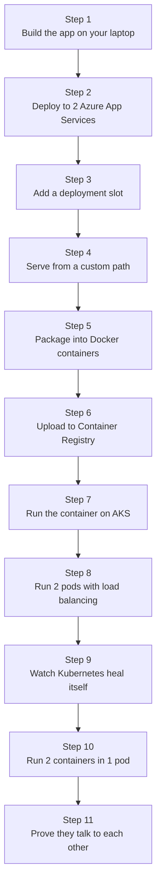
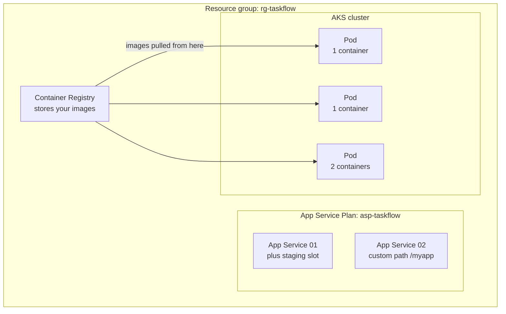

# TaskFlow — Azure Learning Journey

## What is this?

This is a hands-on course. You build **one small application**. Then you deploy that same application to Azure in **six different ways**, each way a little more advanced than the last.

The application never changes. Only the **hosting** changes.

This is the important idea. If something breaks in Step 8, you already know the app itself works, because you tested it in Step 1. So the problem must be in the hosting. This saves you hours of confusion.

---

## The application you will build

A very small app with two parts:

| Part | Technology | What it does |
|------|-----------|--------------|
| Backend | Node.js + Express | Two API endpoints that return JSON |
| Frontend | Angular | A web page that calls the backend and shows the result |

The backend has two endpoints:

- `GET /api/hello` returns a greeting, a version number, and the time
- `GET /api/health` returns whether the app is healthy

That is all. It is deliberately tiny, so you can focus on learning **Azure**, not on learning the app.

---

## The learning path



Each step solves a problem the previous step could not solve. That is the whole point of the course.

---

## Why each step exists

This table is the most useful thing in this file. Come back to it when you forget why you are doing something.

| Step | The problem | The solution |
|------|-------------|--------------|
| 1 | I need something to deploy | Build a small app locally |
| 2 | How do I run my app on the internet? | Azure App Service hosts it for you |
| 3 | If I deploy broken code, users see it immediately | A slot lets you test a new version privately first |
| 4 | I want the app at `/myapp`, not at `/` | Change the app's own routing |
| 5 | "It works on my machine" but breaks on the server | Docker packages the app with everything it needs |
| 6 | My container only exists on my laptop | ACR stores it in Azure so any Azure service can use it |
| 7 | App Service is easy, but I need more control | AKS, which is Kubernetes, gives you full control |
| 8 | One copy of my app is a single point of failure | Run 2 copies and share traffic between them |
| 9 | What if a copy crashes at 3am? | Kubernetes replaces it automatically |
| 10 | I need 2 programs that work as one unit | Put 2 containers in 1 pod |
| 11 | How do I know they actually talk to each other? | Test it from inside the pod |

---

## How the Azure pieces fit together

By the end of the course you will have built all of this:



---

## Files in this folder

```
Ikhlesh-Azure/
├── README.md                     <- you are here
├── TaskFlow_Steps-01-06.md       <- Steps 1 to 6:  App Service, Docker, ACR
└── TaskFlow_Steps-07-11.md       <- Steps 7 to 11: AKS and Kubernetes
```

---

## What you need installed

Install these before you start. Check each one works by running the command shown.

| Tool | Check it works | If it fails |
|------|---------------|-------------|
| Node.js 20 | `node --version` | Download from nodejs.org |
| Angular CLI | `ng version` | `npm install -g @angular/cli` |
| Azure CLI | `az --version` | Download from Microsoft's Azure CLI page |
| Docker | `docker --version` | Install Docker Desktop |
| kubectl | `kubectl version --client` | `az aks install-cli` |

You also need an Azure account with an active subscription.

Log in to Azure once before you start:

```bash
az login
```

---

## How to use these files

1. Read the step.
2. Run the commands yourself. Do not just read them.
3. Check the **Verification** list at the end of each step.
4. Only move to the next step when every box is ticked.

If a verification box does not pass, stop and fix it. Later steps assume earlier steps really worked.

---

## Progress tracker

- [ ] Step 1 — Build the app locally
- [ ] Step 2 — Deploy to two App Services
- [ ] Step 3 — Deployment slot
- [ ] Step 4 — Custom path
- [ ] Step 5 — Docker
- [ ] Step 6 — Azure Container Registry
- [ ] Step 7 — Deploy to AKS
- [ ] Step 8 — Two pods with a Service
- [ ] Step 9 — Self-healing
- [ ] Step 10 — One pod, two containers
- [ ] Step 11 — Container-to-container communication

---

## A note about the diagrams

The diagrams in these files are written in **Mermaid**. GitHub draws them as real pictures automatically when you view the file on github.com.

If you open the file in a plain text editor, you will see the Mermaid code instead of a picture. That is normal. To preview them locally, install the "Markdown Preview Mermaid Support" extension in VS Code.

---

## Important: delete your resources when finished

Azure charges you while resources exist. The AKS cluster and the Standard App Service Plan are the expensive parts.

When you finish the course, delete everything with one command:

```bash
az group delete --name rg-taskflow --yes --no-wait
```

This deletes the App Services, the container registry, and the AKS cluster together.
