# Steps 1 to 6 — From your laptop to Azure Container Registry

**What you will cover in this file:**

| Step | Topic |
|------|-------|
| 1 | Build the Angular + Node.js app on your laptop |
| 2 | Deploy it to two Azure App Services |
| 3 | Add a deployment slot and stop/start it |
| 4 | Serve the app from a custom path `/myapp` |
| 5 | Put the app inside Docker containers |
| 6 | Upload the containers to Azure Container Registry |

---
---

# STEP 1 — Build the application

## 1.1 What you are doing

You are building a small app on your own computer. No Azure yet.

Why no Azure yet? Because you want to be completely sure the app works before you add Azure to the picture. If you do both at once and something breaks, you will not know which one is broken.

## 1.2 How the app works

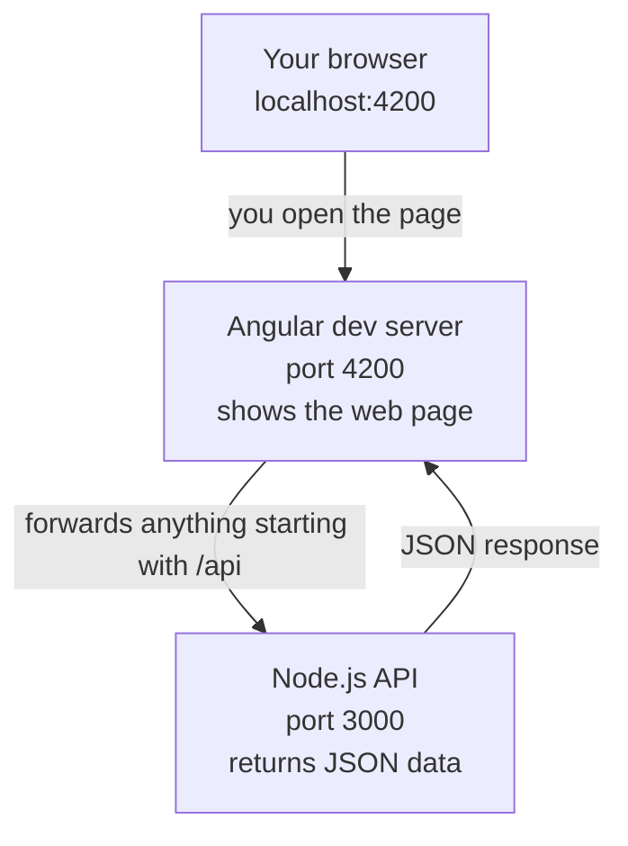

Two separate programs are running:

- The **Angular dev server** on port 4200 shows the web page.
- The **Node.js API** on port 3000 returns the data.

## 1.3 Why we need a proxy

Here is a problem you will hit.

Your web page runs on **port 4200**. Your API runs on **port 3000**. Web browsers have a security rule: a page loaded from one address is not allowed to call a different address. Port 4200 and port 3000 count as different addresses.

So if the page tries to call `http://localhost:3000/api/hello` directly, the browser blocks it. You see a **CORS error** in the browser console.

The fix is a **proxy**. You tell the Angular dev server: "if the page asks for anything starting with `/api`, quietly forward that request to port 3000."

Now the browser thinks it is only ever talking to port 4200. No security rule is broken.

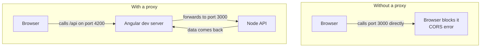

**Remember this idea.** You will see it again in Step 4, and again when you reach Kubernetes. "Send requests to different places based on the URL path" is a pattern you will use three times.

## 1.4 Create the folders

```bash
mkdir taskflow-app
cd taskflow-app
mkdir backend
```

Your folder will end up looking like this:

```
taskflow-app/
├── backend/     <- the Node.js API
└── frontend/    <- the Angular web page, created in 1.9
```

## 1.5 Build the backend

Go into the backend folder and set up a Node project:

```bash
cd backend
npm init -y
npm install express cors
```

What these commands do:

- `npm init -y` creates a `package.json` file. This file lists your project's name, version and dependencies.
- `npm install express cors` downloads two libraries. **Express** is the web server. **cors** is a helper that controls the browser security rule described above.

Now create a file called `server.js` inside `backend`:

```js
const express = require('express');
const cors = require('cors');

const app = express();
app.use(cors());

// The version comes from an environment variable.
// If no environment variable is set, we fall back to '1.0.0'.
const APP_VERSION = process.env.APP_VERSION || '1.0.0';

// Endpoint 1: a simple greeting
app.get('/api/hello', (req, res) => {
  res.json({
    message: 'Hello from Node.js API',
    version: APP_VERSION,
    timestamp: new Date().toISOString()
  });
});

// Endpoint 2: a health check
app.get('/api/health', (req, res) => {
  res.json({
    status: 'Healthy',
    version: APP_VERSION
  });
});

// Azure and Docker will tell us which port to use.
// If nobody tells us, use 3000.
const PORT = process.env.PORT || 3000;

app.listen(PORT, () => {
  console.log('API running on port ' + PORT);
});
```

## 1.6 Two lines in that file are very important

**Line 1: the version**

```js
const APP_VERSION = process.env.APP_VERSION || '1.0.0';
```

This reads the version from an **environment variable**. An environment variable is a setting you pass to a program from outside, without editing its code.

Why does this matter? Because in every later step you will change the version **without touching this file**:

| Step | How you set the version |
|------|------------------------|
| Step 2 | Azure App Service "Application Settings" |
| Step 5 | Docker `-e APP_VERSION=2.0.0` |
| Step 7 | Kubernetes `env:` section in a YAML file |

Three different platforms, one identical idea. You are writing this line now so those three steps are easy later.

**Line 2: the port**

```js
const PORT = process.env.PORT || 3000;
```

On your laptop, the app uses port 3000. But Azure App Service decides its own port and tells your app what it is. If you hardcode 3000, Azure will send traffic to a port your app is not listening on, and you will get a **502 error**.

This single line prevents one of the most common Azure beginner problems.

## 1.7 Add the start script

Open `backend/package.json`. Find the `"scripts"` section and make it look like this:

```json
{
  "name": "taskflow-api",
  "version": "1.0.0",
  "scripts": {
    "start": "node server.js"
  },
  "dependencies": {
    "express": "^4.19.0",
    "cors": "^2.8.5"
  }
}
```

The `"start"` line matters in Step 2. When you deploy to Azure, Azure does not know your file is called `server.js`. Azure just runs `npm start`. That command looks up this `"start"` line to find out what to run.

If this line is missing, Azure deploys successfully but your app never starts.

## 1.8 Test the backend

```bash
node server.js
```

You should see:

```
API running on port 3000
```

Open a **second terminal**, leaving the first one running, and test it:

```bash
curl http://localhost:3000/api/hello
```

Expected result:

```json
{
  "message": "Hello from Node.js API",
  "version": "1.0.0",
  "timestamp": "2026-09-19T10:32:01.452Z"
}
```

## 1.9 Build the frontend

Go back to the main folder and create the Angular app:

```bash
cd ..
ng new frontend --routing=false --style=css
cd frontend
```

This takes a minute or two. Angular downloads a lot of files.

Now create a file called `proxy.conf.json` inside the `frontend` folder:

```json
{
  "/api": {
    "target": "http://localhost:3000",
    "secure": false
  }
}
```

This is the proxy from section 1.3. It says: "any request starting with `/api`, send it to port 3000 instead."

Now open `frontend/src/app/app.component.ts` and replace everything in it with:

```ts
import { Component, OnInit } from '@angular/core';
import { HttpClient, HttpClientModule } from '@angular/common/http';

@Component({
  selector: 'app-root',
  standalone: true,
  imports: [HttpClientModule],
  template: `
    <h1>{{ message }}</h1>
    <p>version: {{ version }}</p>
  `
})
export class AppComponent implements OnInit {
  message = 'Loading...';
  version = '';

  constructor(private http: HttpClient) {}

  ngOnInit() {
    this.http.get<any>('/api/hello').subscribe(response => {
      this.message = response.message;
      this.version = response.version;
    });
  }
}
```

What this does: when the page loads, it calls `/api/hello`, waits for the answer, and puts the message and version onto the page.

Notice it calls `/api/hello`, not `http://localhost:3000/api/hello`. That is deliberate. The proxy handles the rest.

## 1.10 Run everything together

You need **two terminals** open at the same time.

Terminal 1, the backend:
```bash
cd backend
node server.js
```

Terminal 2, the frontend:
```bash
cd frontend
ng serve --proxy-config proxy.conf.json
```

Now open `http://localhost:4200` in your browser.

## 1.11 Expected result

The page shows:

```
Hello from Node.js API

version: 1.0.0
```

If it says "Loading..." forever, the frontend could not reach the backend. See the troubleshooting table below.

## 1.12 Prove the environment variable works

Stop the backend with Ctrl+C in Terminal 1. Then start it again with a different version:

```bash
# Windows PowerShell
$env:APP_VERSION = "9.9.9"
node server.js

# Mac or Linux
APP_VERSION=9.9.9 node server.js
```

Refresh your browser. The page now shows `version: 9.9.9`.

You changed what the app displays **without editing a single file**. This is the whole point of section 1.6. Remember this moment, because Steps 2, 5 and 7 all repeat it.

## 1.13 Verification

Tick every box before moving on.

- [ ] `node server.js` starts and prints "API running on port 3000"
- [ ] `curl http://localhost:3000/api/hello` returns JSON
- [ ] `curl http://localhost:3000/api/health` returns `"status": "Healthy"`
- [ ] The browser at `localhost:4200` shows the message and version
- [ ] Setting `APP_VERSION` changes the displayed version without editing code
- [ ] `backend/package.json` has a `"start": "node server.js"` line

## 1.14 Troubleshooting

| What you see | Why it happens | How to fix it |
|-------------|---------------|--------------|
| Page says "Loading..." forever | You started Angular without the proxy flag, or the backend is not running | Check the backend terminal is still running. Restart Angular with `--proxy-config proxy.conf.json` |
| Red CORS error in browser console | The page is calling port 3000 directly | Make sure your code calls `/api/hello`, not `http://localhost:3000/api/hello` |
| `ng: command not found` | Angular CLI is not installed | Run `npm install -g @angular/cli` |
| `Error: listen EADDRINUSE :::3000` | Another program is already using port 3000 | Close the other program, or set a different port: `PORT=3001 node server.js` |
| `Cannot find module 'express'` | You forgot to install the libraries | Run `npm install express cors` inside the `backend` folder |

---
---

# STEP 2 — Deploy to two Azure App Services

## 2.1 What you are doing

You will put the same backend on Azure, twice, in two separate places. Each one gets its own public web address.

Why twice? Two reasons:

1. To see that two apps can run independently, even though they came from the same code.
2. So that in Step 3 and Step 4 you can change one of them without affecting the other.

## 2.2 Three new Azure words

Before you create anything, learn these three words. Beginners mix them up constantly.

**Resource Group**
A folder for your Azure things. It holds no power and does no work. It just groups things so you can find them and delete them together.

**App Service Plan**
The actual computer. This is what you pay for. It has a size, meaning how much CPU and memory, and an operating system, Linux or Windows.

**App Service**
Your application running on that computer.

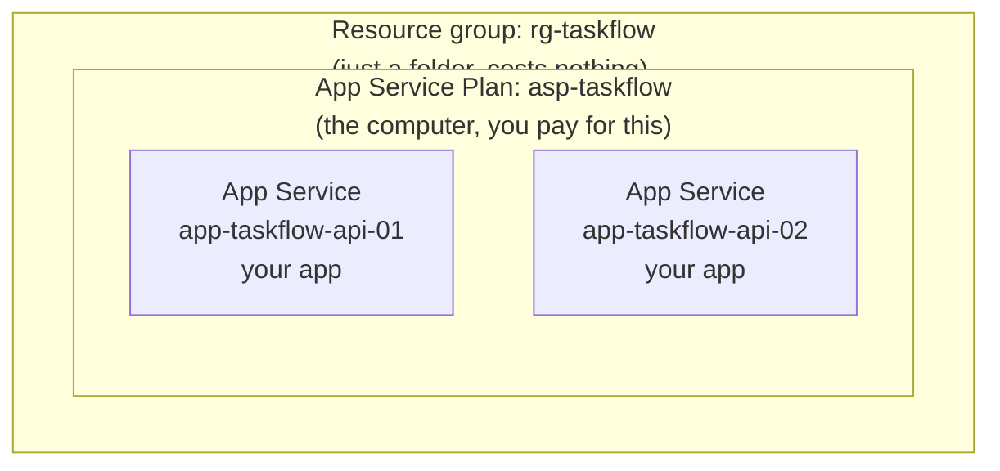

The key thing to understand: **both App Services share one computer.** You pay for one Plan, not two. This is cheaper for learning. But it also means if one app gets very busy, the other one slows down too, because they share the same CPU and memory.

In real production, important apps usually get their own Plan so they cannot slow each other down.

## 2.3 Set your variables

Run these once. Every later command reuses them.

```bash
RG=rg-taskflow
LOCATION=eastus
PLAN=asp-taskflow
```

On Windows PowerShell use this instead:

```powershell
$RG="rg-taskflow"
$LOCATION="eastus"
$PLAN="asp-taskflow"
```

## 2.4 Create the resource group

**Azure Portal way:**
1. Go to portal.azure.com
2. Click **Create a resource**
3. Search for **Resource group**, click **Create**
4. Name: `rg-taskflow`
5. Region: pick one near you
6. Click **Review + create**, then **Create**

**Command line way:**
```bash
az group create --name $RG --location $LOCATION
```

## 2.5 Create the App Service Plan

This is the computer that will run your apps.

```bash
az appservice plan create \
  --name $PLAN \
  --resource-group $RG \
  --sku B1 \
  --is-linux
```

What the options mean:

- `--sku B1` is the size. B1 means "Basic, size 1". It is small and cheap. **Do not use the free F1 tier**, because it cannot do deployment slots, which you need in Step 3.
- `--is-linux` makes it a Linux computer. Linux and Windows plans are completely separate in Azure. You cannot mix Linux and Windows apps on one Plan.

## 2.6 Create the two App Services

```bash
az webapp create \
  --name app-taskflow-api-01 \
  --resource-group $RG \
  --plan $PLAN \
  --runtime "NODE:20-lts"

az webapp create \
  --name app-taskflow-api-02 \
  --resource-group $RG \
  --plan $PLAN \
  --runtime "NODE:20-lts"
```

**Important:** App Service names must be unique across **all of Azure**, not just your account. Somebody else may already have taken `app-taskflow-api-01`. If Azure rejects the name, add something unique to the end, such as `app-taskflow-api-01-ikh`.

If you change the names, remember to use your new names in all the commands that follow.

`--runtime "NODE:20-lts"` tells Azure "this is a Node.js 20 app". Azure then prepares the right environment to run it.

## 2.7 Package your app

Azure needs your code in a zip file.

```bash
cd backend
zip -r ../api.zip . -x "node_modules/*"
```

On Windows, if you do not have `zip`, select the contents of the `backend` folder, right-click, and choose "Send to, Compressed folder". Name it `api.zip`.

**Why do we exclude `node_modules`?**

`node_modules` is the folder with all your downloaded libraries. It is large, and it is built for **your** computer's operating system. Azure runs Linux. Some libraries are compiled differently on different operating systems.

When you upload a zip without `node_modules`, Azure runs `npm install` itself, on its own Linux machine, and gets the correct versions. This is what you want.

If you include `node_modules`, Azure sometimes thinks "this is already built" and skips the install. Then your app may fail with strange errors.

## 2.8 Deploy to both App Services

```bash
az webapp deploy \
  --resource-group $RG \
  --name app-taskflow-api-01 \
  --src-path ../api.zip \
  --type zip

az webapp deploy \
  --resource-group $RG \
  --name app-taskflow-api-02 \
  --src-path ../api.zip \
  --type zip
```

Each deploy takes one to three minutes. Azure unzips your code, runs `npm install`, then runs `npm start`.

What happens during a deploy:

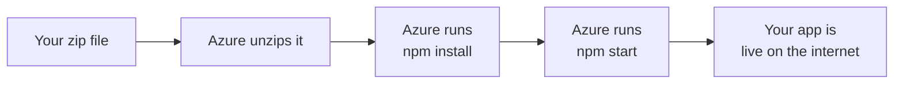

## 2.9 Expected result

Test both apps:

```bash
curl https://app-taskflow-api-01.azurewebsites.net/api/hello
curl https://app-taskflow-api-02.azurewebsites.net/api/hello
```

Both return the same JSON you saw on your laptop in Step 1, with `"version": "1.0.0"`.

Your app is now on the public internet.

## 2.10 See the logs

This is the most useful Azure command you will learn. When something breaks, run this first.

```bash
az webapp log tail --resource-group $RG --name app-taskflow-api-01
```

This shows you what your app is printing, live. You will see your `API running on port ...` message.

Press Ctrl+C to stop watching.

## 2.11 Change the version using Azure settings

Remember section 1.6? Now you get to use it.

```bash
az webapp config appsettings set \
  --resource-group $RG \
  --name app-taskflow-api-01 \
  --settings APP_VERSION=2.0.0
```

Wait about thirty seconds for the app to restart, then test both apps again:

```bash
curl https://app-taskflow-api-01.azurewebsites.net/api/hello   # version 2.0.0
curl https://app-taskflow-api-02.azurewebsites.net/api/hello   # version 1.0.0
```

**Look at what just happened.** Two apps, identical code, running different versions. You changed one without touching the other, and without redeploying anything.

An Azure "Application Setting" is simply an environment variable. It is the exact same mechanism you tested on your laptop in section 1.12.

## 2.12 Start, stop and restart

You can control an App Service without deleting it.

```bash
# Stop it. It stops responding, but nothing is deleted.
az webapp stop --resource-group $RG --name app-taskflow-api-02

# Check its state
az webapp show --resource-group $RG --name app-taskflow-api-02 --query state

# Start it again
az webapp start --resource-group $RG --name app-taskflow-api-02
```

In the Portal, these are buttons at the top of the App Service's Overview page.

**Note:** stopping does not save you money on the Basic tier. You are paying for the App Service Plan, which is the computer, and that keeps running whether your apps are stopped or not.

## 2.13 Verification

- [ ] `az webapp list --resource-group $RG -o table` shows both apps as Running
- [ ] Both `/api/hello` URLs return JSON from the internet
- [ ] Both `/api/health` URLs return `"status": "Healthy"`
- [ ] `az webapp log tail` shows your app's startup message
- [ ] After setting `APP_VERSION` on app 01, the two apps show different versions
- [ ] You can explain the difference between a Plan and an App Service in your own words

## 2.14 Troubleshooting

| What you see | Why it happens | How to fix it |
|-------------|---------------|--------------|
| A blue Azure welcome page instead of your JSON | Your app did not start, so Azure is showing its default page | Run `az webapp log tail` to see the real error |
| **502 Bad Gateway** | Your app started but Azure cannot reach it. Almost always the port | Check `server.js` uses `process.env.PORT`, not a hardcoded 3000 |
| Deploy succeeded but nothing changed | Your zip did not contain what you expected | Unzip `api.zip` somewhere and check `server.js` and `package.json` are at the top level, not inside a subfolder |
| "Website with given name already exists" | App Service names are globally unique | Add your initials to the name and retry |
| App works, then stops working after a while | The free F1 tier has daily limits | Use B1 or higher |

## 2.15 Interview questions

**Q: What is the difference between an App Service and an App Service Plan?**
The Plan is the computer: a set of CPU and memory at a chosen size, on Linux or Windows. That is what you pay for. The App Service is an application running on that computer. Many App Services can share one Plan.

**Q: If two App Services share a Plan and one gets a traffic spike, what happens to the other?**
It can slow down. They share the same CPU and memory. This is why production systems often give important applications their own Plan, so a problem in one app cannot affect another.

**Q: Why does Azure need a `start` script in package.json?**
Azure does not know which of your files is the entry point. It always runs `npm start`, and `npm start` reads that script line to find out. Without it, the deploy succeeds but the app never runs, which usually appears as a 502 error.

---
---

# STEP 3 — Deployment slots

## 3.1 What you are doing

You will add a second, private copy of App Service 01 called **staging**. You will put a new version there, test it, and then stop and start it.

## 3.2 The problem slots solve

Right now, if you deploy new code, it goes live instantly. If the code is broken, every user sees the broken version straight away. You find out from angry users.

A slot fixes this. A slot is a second copy of your app, inside the same App Service, with **its own separate web address**.

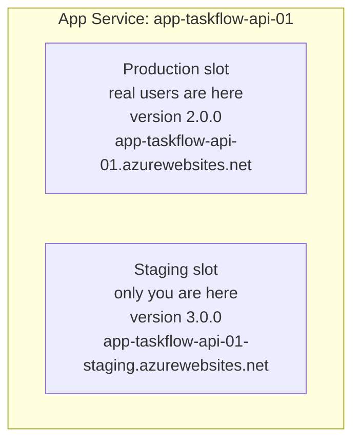

You deploy to staging. You test staging. Real users never see it. Only when you are happy do you promote it.

## 3.3 Requirement: you need the Standard tier

Deployment slots do not work on the Basic (B1) tier. Upgrade the Plan:

```bash
az appservice plan update \
  --name $PLAN \
  --resource-group $RG \
  --sku S1
```

This costs more per hour. Remember to delete everything at the end of the course.

## 3.4 Create the slot

**Azure Portal way:**
1. Open `app-taskflow-api-01`
2. In the left menu, click **Deployment slots**
3. Click **Add Slot**
4. Name: `staging`
5. Clone settings from: **Do not clone settings**
6. Click **Add**

**Command line way:**
```bash
az webapp deployment slot create \
  --name app-taskflow-api-01 \
  --resource-group $RG \
  --slot staging
```

Your new slot has its own address:
`https://app-taskflow-api-01-staging.azurewebsites.net`

## 3.5 The most important warning in this step

**Every slot command needs `--slot staging`.**

If you forget it, the command targets **production** instead. This is how people accidentally stop their live website.

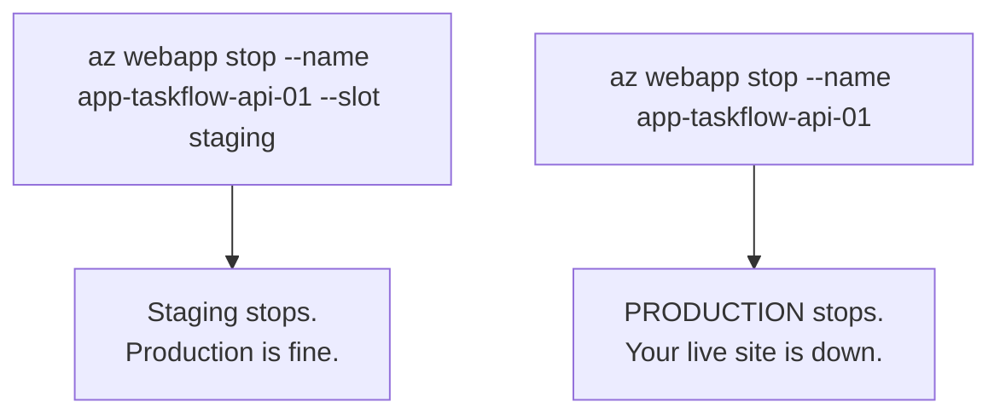

Make it a habit: type `--slot staging` immediately after the app name, before you type anything else.

## 3.6 Deploy a new version to staging only

Change the version in your code so you can tell the two apart. Edit `backend/server.js`:

```js
const APP_VERSION = process.env.APP_VERSION || '3.0.0';
```

Rezip and deploy to the slot:

```bash
cd backend
zip -r ../api-v3.zip . -x "node_modules/*"

az webapp deploy \
  --resource-group $RG \
  --name app-taskflow-api-01 \
  --slot staging \
  --src-path ../api-v3.zip \
  --type zip
```

## 3.7 Expected result

Test both addresses:

```bash
# Production, real users see this
curl https://app-taskflow-api-01.azurewebsites.net/api/hello
# version: 2.0.0, unchanged from Step 2.11

# Staging, only you see this
curl https://app-taskflow-api-01-staging.azurewebsites.net/api/hello
# version: 3.0.0, your new code
```

Two versions, running at the same time, inside one App Service. Production users are completely unaffected by your new code.

## 3.8 Stop and start the slot

```bash
# Stop the staging slot
az webapp stop --resource-group $RG --name app-taskflow-api-01 --slot staging

# Confirm it is stopped
az webapp show --resource-group $RG --name app-taskflow-api-01 --slot staging --query state
# Expected: "Stopped"

# Now test the staging URL. It will fail.
curl https://app-taskflow-api-01-staging.azurewebsites.net/api/hello

# Now test production. It still works perfectly.
curl https://app-taskflow-api-01.azurewebsites.net/api/hello

# Start staging again
az webapp start --resource-group $RG --name app-taskflow-api-01 --slot staging
```

**Understand the difference between two failure types:**

| Response | Meaning |
|----------|---------|
| 403 or a "stopped" page | Azure deliberately is not running it. You stopped it. |
| 502 Bad Gateway | Azure tried to run it, but the app crashed. |

These look similar but mean opposite things. A 403 after stopping is expected and correct. A 502 means something is actually broken.

## 3.9 Verification

- [ ] Production shows one version and staging shows a different version, at the same time
- [ ] Stopping staging does not affect production
- [ ] Starting staging brings it back
- [ ] You checked production's state and it never said "Stopped"
- [ ] You can explain when you would use a slot in real work

## 3.10 Troubleshooting

| What you see | Why it happens | How to fix it |
|-------------|---------------|--------------|
| "Cannot create slot" error | You are still on the Basic (B1) tier | Upgrade to S1, see section 3.3 |
| Production went down unexpectedly | You forgot `--slot staging` on a stop command | `az webapp start --resource-group $RG --name app-taskflow-api-01` with no slot flag |
| Staging shows the old version | The deploy went to production instead | Redeploy, and check you included `--slot staging` |

## 3.11 Interview questions

**Q: Why does a deployment slot need its own web address?**
So you can test the new version properly while real users continue using the old one. If both shared an address, there would be no way to reach the new version without exposing it to everybody.

**Q: What is the difference between stopping a slot and deleting it?**
Stopping pauses the running app. The slot, its settings and its deployed code all stay. You can start it again in seconds. Deleting removes the slot completely, including its configuration. Stop when you are pausing temporarily. Delete when you are finished with it.

**Q: What is a slot swap and why would you use it?**
A swap exchanges the staging slot with production. The version you tested in staging becomes the live version, and the old production version moves into staging. Because the app in staging is already running and warmed up, the switch is nearly instant, and if something goes wrong you can swap back to undo it.

---
---

# STEP 4 — Custom path `/myapp`

## 4.1 What you are doing

Right now your API answers at `/api/hello`. You will change App Service 02 so it answers at `/myapp/api/hello` instead.

## 4.2 An important Azure fact first

If you search the internet for "Azure App Service custom path", you will find articles about **Path mappings** and **virtual directories** in the Azure Portal.

**Those do not work for your app.** Here is why.

Virtual directories are a feature of **IIS**, which is Microsoft's Windows web server. They only exist on **Windows** App Services. Your App Service is **Linux**, because you used `--is-linux` in Step 2.5.

On a Linux App Service, that same Portal screen only lets you attach file storage. There is no URL path mapping option at all.

So what do you do instead? **Your application handles the path itself.** This is not a workaround. For Linux and container apps, this is the normal, correct approach.

Go and look for yourself, so this sticks:
1. Open `app-taskflow-api-02` in the Portal
2. Click **Configuration** in the left menu
3. Click the **Path mappings** tab
4. Notice there are only storage mount options, no URL paths

## 4.3 How it will work

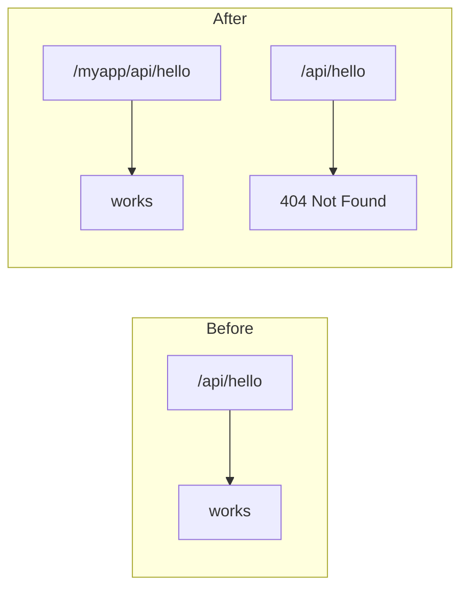

## 4.4 Change the code

Open `backend/server.js`. You are going to make one structural change.

Instead of attaching endpoints directly to `app`, you attach them to a **Router**, then mount that whole Router under `/myapp`.

```js
const express = require('express');
const cors = require('cors');

const app = express();
app.use(cors());

const APP_VERSION = process.env.APP_VERSION || '1.0.0';

// Create a router. Think of it as a group of endpoints.
const router = express.Router();

router.get('/api/hello', (req, res) => {
  res.json({
    message: 'Hello from Node.js API',
    version: APP_VERSION,
    timestamp: new Date().toISOString()
  });
});

router.get('/api/health', (req, res) => {
  res.json({
    status: 'Healthy',
    version: APP_VERSION
  });
});

// THIS is the line that adds /myapp in front of every route above.
app.use('/myapp', router);

const PORT = process.env.PORT || 3000;
app.listen(PORT, () => {
  console.log('API running on port ' + PORT);
});
```

## 4.5 Why write it this way

Notice the endpoint definitions did not change. They still say `/api/hello`. Only one new line was added:

```js
app.use('/myapp', router);
```

That one line puts `/myapp` in front of every route in the group.

**Compare this with the bad way**, where someone writes the prefix into every single route:

```js
// DO NOT DO THIS
app.get('/myapp/api/hello', ...);
app.get('/myapp/api/health', ...);
```

Both work today. But imagine six months from now your boss says "change `/myapp` to `/taskflow`".

- Good way: change one line.
- Bad way: find and change every route, and hope you did not miss one.

This is a small example of a big principle: put a setting in one place, not scattered through your code.

## 4.6 Deploy to App Service 02 only

```bash
cd backend
zip -r ../api-myapp.zip . -x "node_modules/*"

az webapp deploy \
  --resource-group $RG \
  --name app-taskflow-api-02 \
  --src-path ../api-myapp.zip \
  --type zip
```

## 4.7 Expected result

```bash
# New path, works
curl https://app-taskflow-api-02.azurewebsites.net/myapp/api/hello
# Returns your JSON

# Old path, now gone
curl https://app-taskflow-api-02.azurewebsites.net/api/hello
# Returns 404 Not Found

# App Service 01, untouched, still on the old path
curl https://app-taskflow-api-01.azurewebsites.net/api/hello
# Still returns your JSON
```

The 404 on the old path is **good news**. It proves the change really took effect and is not a coincidence.

## 4.8 A useful debugging trick

Azure gives every App Service a hidden tool called **Kudu**. It lets you open a terminal **inside** your running app.

1. Go to `app-taskflow-api-02` in the Portal
2. Click **Advanced Tools** in the left menu
3. Click **Go**
4. Click **Debug console**, then **Bash**
5. Run: `curl http://localhost:8080/myapp/api/hello`

Why is this useful? If this works inside the container but your public URL does not, you know the app is fine and the problem is in Azure's networking in front of it. That instantly cuts your search in half.

## 4.9 Verification

- [ ] `/myapp/api/hello` returns 200 and your JSON
- [ ] `/api/hello` on app 02 returns 404
- [ ] App Service 01 still works on its original paths
- [ ] You looked at the Path mappings screen and saw there are no URL options on Linux

## 4.10 Troubleshooting

| What you see | Why it happens | How to fix it |
|-------------|---------------|--------------|
| Both paths return 404 | The new code did not start | `az webapp log tail` to check. Restart the app if needed |
| Cannot find "virtual directory" in the Portal | You are on Linux, that feature is Windows only | See section 4.2. Use application routing instead |
| Your Angular frontend broke | It still calls the old path | Update the URL in the Angular code, rebuild, redeploy |

## 4.11 Interview questions

**Q: Why can you not use Azure's virtual directory feature on a Linux App Service?**
Virtual directories are provided by IIS, which is the Windows web server. Linux App Services do not run IIS, so the feature does not exist there. On Linux you handle URL paths inside the application itself, or with a reverse proxy in front of it.

**Q: You need two different applications on one address, one at `/app1` and one at `/app2`. How would you do it?**
Put a routing layer in front of both. In Azure that would be Application Gateway or Azure Front Door with path-based rules. In Kubernetes it would be an Ingress controller. The routing decision belongs to the layer in front, because neither application can route to the other.

**Q: Why use `app.use('/myapp', router)` instead of writing the prefix into each route?**
It keeps the path in one place. Changing it later is a one-line edit instead of a risky search-and-replace across the whole codebase.

---
---

# STEP 5 — Docker

## 5.1 What you are doing

You will package your app into a **container image**, then run it on your laptop as a container.

## 5.2 What Docker actually solves

You know the phrase "it works on my machine". Docker exists to end that sentence.

Your app needs Node.js version 20. It needs Express and cors. It needs certain files in certain places. If the server has Node 18 instead of 20, your app may break in strange ways.

A **container image** is a package containing your app **and** everything it needs to run: the Node.js runtime, the libraries, the files, the startup command. Everything.

Anywhere that image runs, it runs identically. Your laptop, Azure, a colleague's Mac, all the same.

## 5.3 Image vs container

People confuse these two words constantly. Here is the difference.

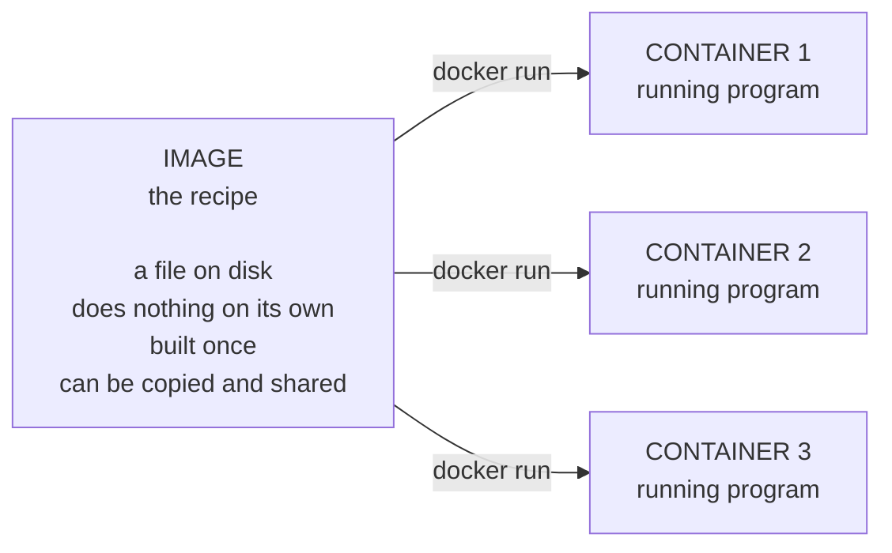

An image is like a class in programming. A container is like an object created from that class. One image can produce many containers at the same time.

## 5.4 The Dockerfile

A Dockerfile is a recipe. It lists the steps to build your image.

Create `backend/Dockerfile`:

```dockerfile
# ---- Stage 1: build ----
FROM node:20-alpine AS build
WORKDIR /app
COPY package*.json ./
RUN npm ci --omit=dev
COPY . .

# ---- Stage 2: the final image ----
FROM node:20-alpine
WORKDIR /app
COPY --from=build /app ./
EXPOSE 3000
CMD ["node", "server.js"]
```

Line by line:

| Line | What it does |
|------|-------------|
| `FROM node:20-alpine` | Start from a ready-made image that already has Node.js 20. "alpine" means a very small Linux |
| `WORKDIR /app` | Work inside the `/app` folder from now on |
| `COPY package*.json ./` | Copy only the package files first |
| `RUN npm ci --omit=dev` | Install the libraries |
| `COPY . .` | Now copy the rest of your code |
| `EXPOSE 3000` | Document that this app listens on port 3000 |
| `CMD ["node", "server.js"]` | The command to run when the container starts |

## 5.5 Why copy package.json before the rest of the code

This looks strange, but there is a good reason.

Docker saves each step as a **layer**, and reuses layers that have not changed. Installing libraries is slow. Copying your code is fast.

If you copied everything at once, then every time you change one line of `server.js`, Docker would reinstall every library from scratch.

By copying `package.json` first, Docker only reinstalls libraries when `package.json` itself changes. Editing `server.js` reuses the cached install step and builds in seconds instead of minutes.

## 5.6 Why two stages

Notice the Dockerfile says `FROM` twice. This is called a **multi-stage build**.

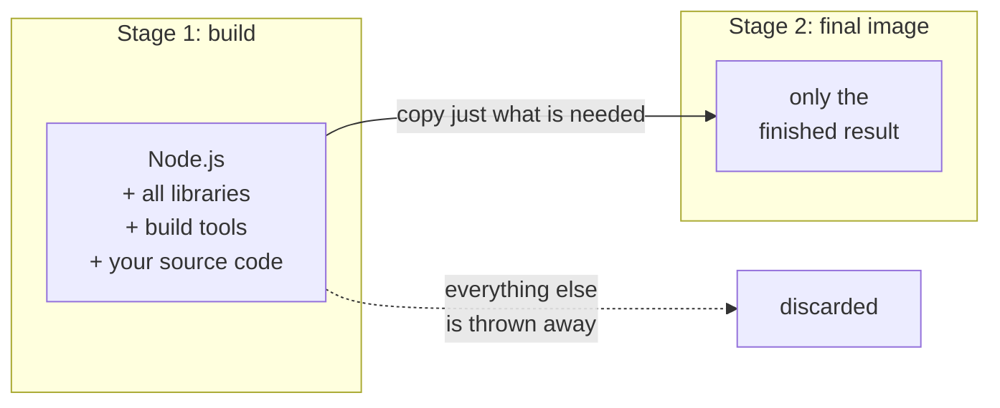

Why bother? Because the build stage may need tools that the final running app does not need. Leaving them in makes your image bigger, slower to upload, slower to download, and gives attackers more to work with.

For the frontend this matters a lot. Building Angular needs the whole Angular toolchain, hundreds of megabytes. But running the finished website needs none of it, just the static files and a small web server.

## 5.7 Frontend Dockerfile

Create `frontend/Dockerfile`:

```dockerfile
# ---- Stage 1: build the Angular app ----
FROM node:20-alpine AS build
WORKDIR /app
COPY package*.json ./
RUN npm ci
COPY . .
RUN npx ng build --configuration production

# ---- Stage 2: serve the finished files with nginx ----
FROM nginx:alpine
COPY --from=build /app/dist/frontend/browser /usr/share/nginx/html
COPY nginx.conf /etc/nginx/conf.d/default.conf
EXPOSE 80
```

Stage 1 uses Node to build Angular into plain HTML, CSS and JavaScript files.
Stage 2 throws away Node entirely and uses **nginx**, a small fast web server, to serve those files.

The final image contains no Node.js and no Angular tooling at all. Just nginx and your built files.

## 5.8 The nginx config and why you need it

Create `frontend/nginx.conf`:

```nginx
server {
  listen 80;
  location / {
    root /usr/share/nginx/html;
    try_files $uri $uri/ /index.html;
  }
}
```

The important line is `try_files $uri $uri/ /index.html;`.

Here is the problem it solves. Angular is a single-page application. When you click a link inside the app, Angular changes the URL in the browser without asking the server for anything.

But if the user presses **F5** to refresh on that URL, the browser now asks nginx for that exact path. nginx looks for a file with that name, does not find one, and returns 404.

`try_files` tells nginx: "if you cannot find a matching file, send `index.html` instead". Angular then loads and works out the correct page from the URL.

Without this line, your app works until somebody refreshes the page.

## 5.9 Build the images

```bash
docker build -t taskflow-api:v1 ./backend
docker build -t taskflow-web:v1 ./frontend
```

`-t taskflow-api:v1` gives the image a name and a tag. The name is `taskflow-api`. The tag is `v1`, which is the version.

Check what you built:

```bash
docker images
```

## 5.10 Run a container

```bash
docker run -d --name api-test -p 3000:3000 -e APP_VERSION=5.0.0 taskflow-api:v1
```

Every option explained:

| Option | Meaning |
|--------|---------|
| `-d` | Run in the background, so you get your terminal back |
| `--name api-test` | Give the container a name you can remember, instead of a random ID |
| `-p 3000:3000` | Connect port 3000 on your laptop to port 3000 inside the container |
| `-e APP_VERSION=5.0.0` | Set an environment variable inside the container |

**Look at that `-e` option.** It is the same idea as Step 1.12 and Step 2.11. Third platform, same concept.

Port mapping explained:

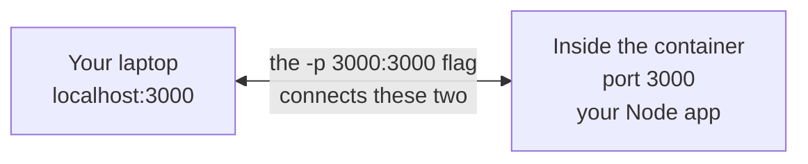

The left number is your laptop. The right number is inside the container. They do not have to be the same.

## 5.11 Test it

```bash
curl http://localhost:3000/myapp/api/hello
```

You should get JSON with `"version": "5.0.0"`.

## 5.12 Useful Docker commands

```bash
# See running containers
docker ps

# See the container's output
docker logs api-test

# Open a shell inside the container
docker exec -it api-test sh

# Stop it
docker stop api-test

# Start it again
docker start api-test

# Remove it. It must be stopped first.
docker rm api-test
```

`docker logs` is your `az webapp log tail` for Docker. When a container will not work, run this first.

## 5.13 Run the frontend too

```bash
docker run -d --name web-test -p 8080:80 taskflow-web:v1
```

Open `http://localhost:8080` in your browser.

Note the port mapping is `8080:80`. Inside the container nginx listens on port 80. On your laptop you reach it at port 8080.

## 5.14 Clean up

```bash
docker stop api-test web-test
docker rm api-test web-test
```

## 5.15 Verification

- [ ] `docker build` succeeded for both images
- [ ] `docker images` shows both, and `taskflow-api` is under about 200 MB
- [ ] `docker run` plus `curl` returns your JSON
- [ ] The `-e APP_VERSION` value appears in the response
- [ ] `docker logs` shows your startup message
- [ ] The frontend container serves a page at `localhost:8080`
- [ ] You can explain the difference between an image and a container

## 5.16 Troubleshooting

| What you see | Why it happens | How to fix it |
|-------------|---------------|--------------|
| `npm ci` fails: "lock file not found" | `npm ci` requires `package-lock.json` | Run `npm install` once in that folder, then rebuild |
| Container exits immediately | The app crashed on startup | `docker logs api-test` shows the real error |
| `curl` says connection refused | Container is not running, or the port mapping is wrong | `docker ps` to check both |
| Image is 400 MB or more | Build tools got into the final stage | Check stage 2 only copies the built output |
| Angular page 404s after refresh | Missing `try_files` line in nginx.conf | Add it, see section 5.8 |
| "Cannot connect to the Docker daemon" | Docker Desktop is not running | Start Docker Desktop and wait for it to be ready |

## 5.17 Interview questions

**Q: What is the difference between an image and a container?**
An image is a file on disk, a packaged template that does nothing by itself. A container is a running instance created from that image. One image can produce many containers running at the same time.

**Q: Why use a multi-stage Dockerfile?**
Because the tools needed to build an app are not needed to run it. Building Angular needs the full toolchain, hundreds of megabytes. Running the result needs only static files and a small web server. Multi-stage lets you copy just the finished output into a clean final image, keeping it small and reducing what an attacker could use.

**Q: What is the difference between `npm ci` and `npm install`?**
`npm install` can update the lock file and tolerate small differences. `npm ci` installs exactly what the lock file says and fails if anything does not match. Docker builds should be identical every time, so `npm ci` is the right choice there.

**Q: Why copy package.json before the application code?**
For layer caching. Docker reuses unchanged layers. Copying package files first means library installation is only redone when dependencies actually change, not every time you edit a source file.

---
---

# STEP 6 — Azure Container Registry

## 6.1 What you are doing

Your images currently exist only on your laptop. You will upload them to **Azure Container Registry**, usually shortened to ACR, which is a private storage service for container images.

## 6.2 Why you need a registry

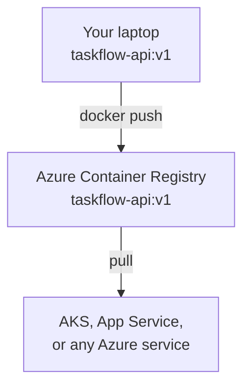

AKS in Step 7 needs to download your image. It cannot reach your laptop. A registry is the shared place both sides can use.

## 6.3 Why ACR and not Docker Hub

Docker Hub is the well-known public registry. ACR is Azure's private one. For this course ACR is better for two reasons:

1. **It is private.** Your images are not public.
2. **It connects to AKS without passwords.** In Step 7, one command gives your Kubernetes cluster permission to pull images. No password is stored anywhere. With Docker Hub you would have to create and manage a secret inside the cluster.

## 6.4 Create the registry

**Portal way:**
1. Open `rg-taskflow`
2. Click **Create**, then search for **Container Registry**
3. Registry name: `acrtaskflowikh`, or choose your own, see the note below
4. SKU: **Basic**
5. **Review + create**

**Command line way:**
```bash
ACR=acrtaskflowikh

az acr create \
  --resource-group $RG \
  --name $ACR \
  --sku Basic
```

**Naming rules:** the registry name must be globally unique across all of Azure, and it can only contain lowercase letters and numbers. No hyphens, no underscores, no capitals. If your name is taken, add more characters.

## 6.5 Log in to the registry

```bash
az acr login --name $ACR
```

This gives Docker on your laptop permission to upload to your registry.

It does this using your existing `az login` session, and the permission it creates expires after a few hours. You never type or store a registry password. This matters because a password would be a long-lived secret that could leak. A short-lived token tied to your real identity is safer, and Azure's logs can show exactly who pushed what.

For this reason, leave **Admin user** switched **off** in the Portal. You do not need it.

## 6.6 Tag your images

Before you can upload an image, its name must include the registry address.

```bash
docker tag taskflow-api:v1 $ACR.azurecr.io/taskflow-api:v1
docker tag taskflow-web:v1 $ACR.azurecr.io/taskflow-web:v1
```

**Why is tagging a separate command?**

A Docker image name includes where it belongs. The name `taskflow-api:v1` has no registry in it, so Docker assumes Docker Hub.

`docker tag` adds a second name pointing at the exact same image. Nothing is copied or rebuilt, and no extra disk space is used. It is like adding a second label to the same box.

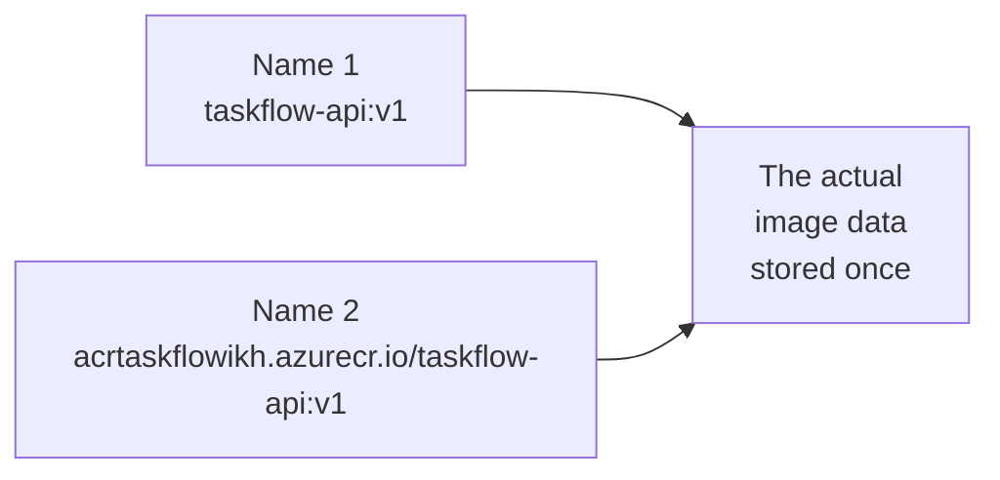

When you push, Docker reads the registry address from the name and knows where to send it.

## 6.7 Push the images

```bash
docker push $ACR.azurecr.io/taskflow-api:v1
docker push $ACR.azurecr.io/taskflow-web:v1
```

This uploads them. It may take a few minutes the first time.

## 6.8 Verify the images really arrived

Do not trust "push succeeded" on your own screen. Ask Azure what it actually has:

```bash
az acr repository list --name $ACR --output table
```

Expected:

```
Result
--------------
taskflow-api
taskflow-web
```

```bash
az acr repository show-tags --name $ACR --repository taskflow-api --output table
```

Expected:

```
Result
--------
v1
```

## 6.9 Prove it is really downloadable

This is a stronger test. Delete your local copy, then download it back from Azure:

```bash
docker rmi $ACR.azurecr.io/taskflow-api:v1
docker pull $ACR.azurecr.io/taskflow-api:v1
```

If the pull works, your image genuinely lives in Azure and is not just cached on your machine.

## 6.10 Verification

- [ ] `az acr repository list` shows both images
- [ ] `az acr repository show-tags` shows `v1`
- [ ] You deleted the local image and pulled it back successfully
- [ ] Admin user is still disabled in the Portal
- [ ] You can explain why tagging and pushing are two separate steps

## 6.11 Troubleshooting

| What you see | Why it happens | How to fix it |
|-------------|---------------|--------------|
| "denied: requested access to the resource is denied" | Your login expired, or the tag has the wrong registry name | Run `az acr login --name $ACR` again. Check `docker images` shows the right full name |
| Registry name rejected | Names must be globally unique, lowercase letters and numbers only | Try a longer, more unique name |
| Push is extremely slow | Your image is large, or your upload speed is limited | Check the image size. A good multi-stage build should be small |
| "unauthorized" even after logging in | You are logged into the wrong Azure subscription | `az account show` to check. `az account set --subscription <id>` to change |

## 6.12 Interview questions

**Q: Why is `az acr login` safer than using an admin username and password?**
It issues a short-lived token tied to your own Azure identity. Nothing long-lived is stored, the token expires on its own, and Azure's audit logs show which person performed each push or pull. An admin password is a single permanent secret shared by everyone, and if it leaks, anyone can use it with no way to tell who.

**Q: Why are `docker tag` and `docker push` separate commands?**
Because an image's name includes where it is stored. Tagging adds a name containing the registry address, without copying or rebuilding anything. Pushing then reads that address and uploads the data there.

**Q: Why choose ACR over Docker Hub for a project running on AKS?**
ACR integrates with AKS directly. One command grants the cluster permission to pull images using its own managed identity, so no registry password ever has to exist inside the cluster. With Docker Hub you would create a Kubernetes secret containing real credentials, which then has to be stored, protected and rotated.

---
---

# You have finished Steps 1 to 6

What you have now:

- A working Angular + Node.js app
- Two App Services running it, on different versions
- A deployment slot for safe testing
- One App Service serving from a custom path
- Two Docker images
- Both images stored in Azure Container Registry

**Next:** open `TaskFlow_Steps-07-11.md` to deploy these images to Kubernetes.
