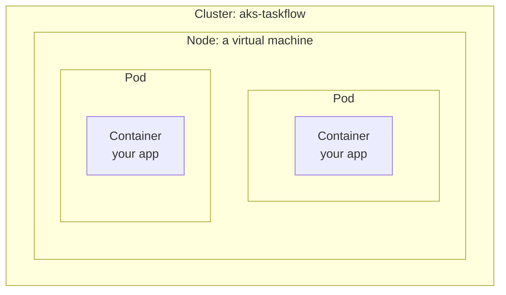
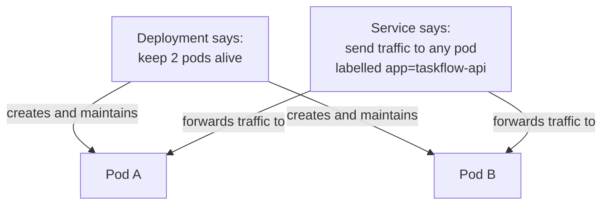
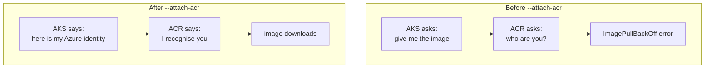
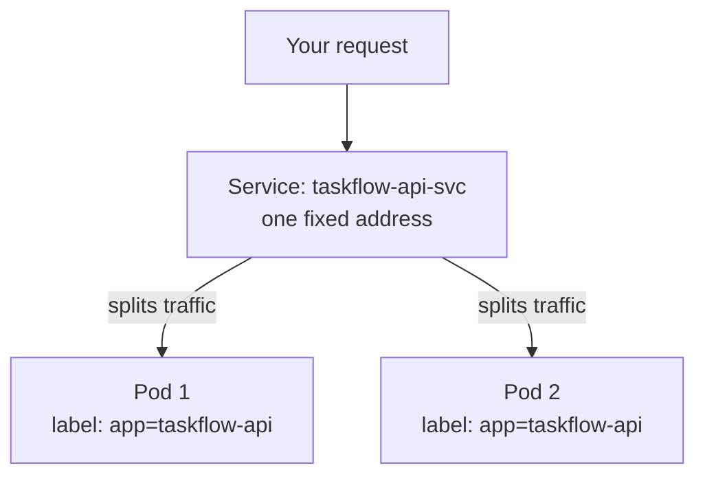
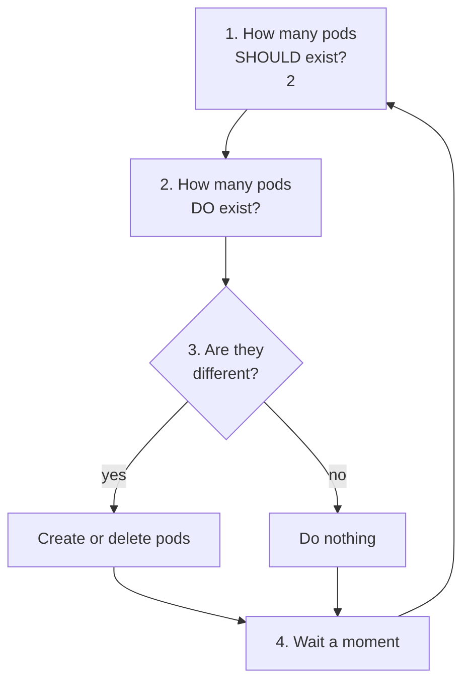
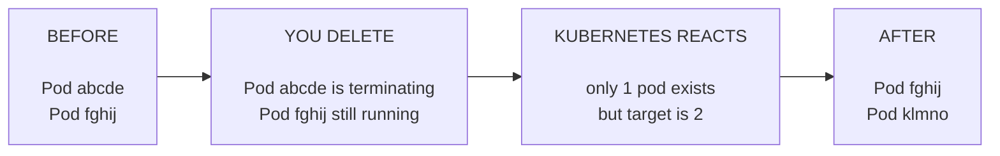
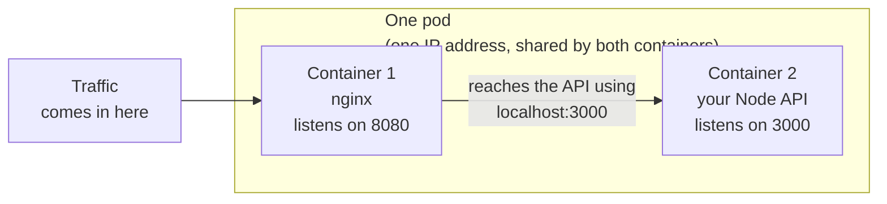
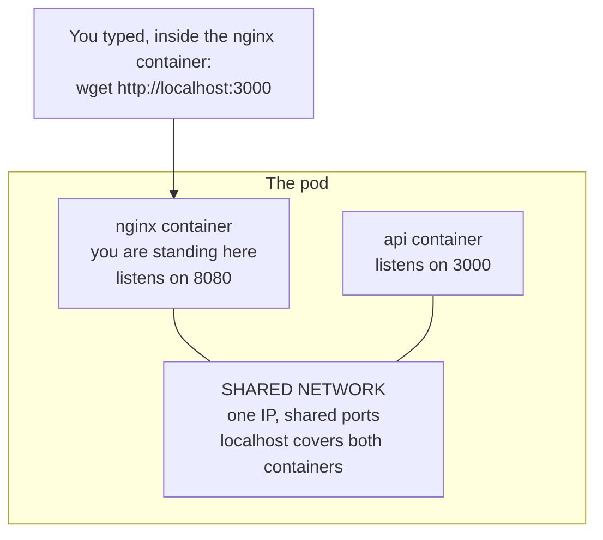
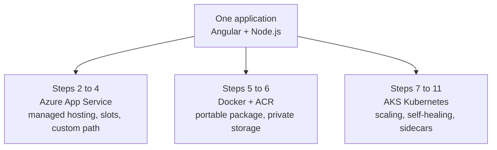

# Steps 7 to 11 — Kubernetes (AKS)

**Before you start this file**, you should have finished Steps 1 to 6. You need:

- Two images in your Azure Container Registry: `taskflow-api:v1` and `taskflow-web:v1`
- `kubectl` installed, check with `kubectl version --client`

**What you will cover in this file:**

| Step | Topic |
|------|-------|
| 7 | Create an AKS cluster and run one pod |
| 8 | Run two pods and share traffic between them |
| 9 | Delete a pod and watch Kubernetes replace it |
| 10 | Run two containers inside one pod |
| 11 | Prove the two containers can talk to each other |

---
---

# Kubernetes words you must know first

Do not skip this section. Steps 7 to 11 use these words constantly. Learn them now and the rest is easy.

## The words

**Cluster**
A group of computers working together to run your containers. In Azure this is called AKS, short for Azure Kubernetes Service.

**Node**
One computer inside the cluster. It is a virtual machine.

**Pod**
The smallest unit Kubernetes manages. A pod holds one or more containers. Usually one.

**Container**
Your actual running application, from the image you built in Step 5.

**Deployment**
A set of instructions saying "always keep this many copies of this pod running". Kubernetes obeys this continuously.

**Service**
A stable address that sends traffic to your pods. Pods come and go. The Service address stays the same.

**Label**
A name tag stuck on a pod, for example `app: taskflow-api`. Services use labels to find which pods to send traffic to.

## How they fit together



Read it from the outside in: a **cluster** contains **nodes**. A node runs **pods**. A pod holds **containers**.

## Deployment and Service, explained simply

These two confuse beginners the most. Here is the difference.

**A Deployment answers: how many copies should exist?**

You write `replicas: 2`. Kubernetes then makes sure two pods exist. Always. If one dies, it creates another. You do not ask it to. It just does it, forever.

**A Service answers: what address do I use to reach them?**

Pods get IP addresses, but those addresses change every time a pod is replaced. You cannot rely on them. A Service gives you one fixed address, and it automatically forwards traffic to whichever pods currently exist.



---
---

# STEP 7 — Create AKS and run one pod

## 7.1 What you are doing

You will create a Kubernetes cluster, connect it to your container registry, and run a single pod.

Why only one pod, when Step 8 wants two? Because you are testing one thing at a time. If you jumped straight to two pods plus a Service and something failed, you would not know whether the problem was your image or your Service configuration. Proving one pod works first removes half the possibilities.

## 7.2 Create the cluster

```bash
RG=rg-taskflow
AKS=aks-taskflow
ACR=acrtaskflowikh        # use YOUR registry name from Step 6

az aks create \
  --resource-group $RG \
  --name $AKS \
  --node-count 1 \
  --generate-ssh-keys
```

**This takes five to ten minutes.** Azure is creating virtual machines and setting up Kubernetes on them. Be patient.

`--node-count 1` means one virtual machine. That is enough for learning. Real systems use three or more so that losing one machine does not take everything down.

## 7.3 Connect kubectl to your cluster

`kubectl` is the command-line tool for Kubernetes. Right now it does not know your cluster exists. Tell it:

```bash
az aks get-credentials --resource-group $RG --name $AKS
```

This downloads the connection details and saves them on your computer.

Check it worked:

```bash
kubectl get nodes
```

Expected:

```
NAME                                STATUS   ROLES   AGE   VERSION
aks-nodepool1-12345678-vmss000000   Ready    agent   5m    v1.29.0
```

If you see `Ready`, you are connected.

## 7.4 Give AKS permission to pull your images

Your images are in a **private** registry. By default, AKS cannot download them.

```bash
az aks update \
  --resource-group $RG \
  --name $AKS \
  --attach-acr $ACR
```

**What this does:** your AKS cluster has its own identity in Azure, called a managed identity. This command gives that identity permission to read from your registry.

**Why this is good:** no password is created, stored or typed anywhere. The cluster proves who it is using its own Azure identity.

**Without this command:** you would have to create a Kubernetes secret containing a real registry username and password, store it in the cluster, protect it, and rotate it when it expires.



## 7.5 Write your first Kubernetes file

Kubernetes is configured with YAML files. Create `api-deployment-v1.yaml`:

```yaml
apiVersion: apps/v1
kind: Deployment
metadata:
  name: taskflow-api
spec:
  replicas: 1
  selector:
    matchLabels:
      app: taskflow-api
  template:
    metadata:
      labels:
        app: taskflow-api
    spec:
      containers:
        - name: api
          image: acrtaskflowikh.azurecr.io/taskflow-api:v1
          ports:
            - containerPort: 3000
          env:
            - name: APP_VERSION
              value: "7.0.0"
```

**Change `acrtaskflowikh` to your own registry name.**

## 7.6 Understanding that file

YAML uses indentation to show what belongs to what. Read it top to bottom:

| Part | Meaning |
|------|---------|
| `kind: Deployment` | The type of thing you are creating |
| `metadata.name` | What to call it |
| `replicas: 1` | Keep exactly 1 pod running |
| `selector.matchLabels` | Which pods this Deployment is responsible for |
| `template` | The blueprint for creating pods |
| `template.metadata.labels` | Labels to stick on each pod it creates |
| `containers.image` | Which image to run |
| `containerPort: 3000` | The port your app listens on inside the container |
| `env` | Environment variables, the same idea as Steps 1, 2 and 5 |

**One thing that trips up beginners:** `selector.matchLabels` and `template.metadata.labels` must match each other exactly. The selector says "I manage pods with this label". The template says "the pods I create get this label". If they disagree, the Deployment creates pods it does not recognise as its own.

## 7.7 Apply it

```bash
kubectl apply -f api-deployment-v1.yaml
```

`apply` means "make the cluster look like this file". It creates things that do not exist and updates things that do.

Watch the pod start:

```bash
kubectl get pods -w
```

The `-w` means "watch", so it keeps updating. Press Ctrl+C to stop.

## 7.8 Expected result

```
NAME                            READY   STATUS              AGE
taskflow-api-7d9c8f6b4d-x2k9p   0/1     ContainerCreating   2s
taskflow-api-7d9c8f6b4d-x2k9p   1/1     Running             15s
```

`READY 1/1` means one container out of one is ready. Your pod is running.

**About that pod name:** you did not choose it. Kubernetes generated it from your Deployment name, a hash, and a random suffix. This matters in Step 9.

## 7.9 Test the app

There is no Service yet, so the pod has no public address. Use port forwarding to reach it temporarily:

```bash
kubectl port-forward pod/taskflow-api-7d9c8f6b4d-x2k9p 3000:3000
```

Use **your** pod's actual name from `kubectl get pods`.

In a second terminal:

```bash
curl http://localhost:3000/myapp/api/hello
```

You get the same JSON you have seen since Step 1, now with `"version": "7.0.0"`.

**Stop and appreciate this.** The exact same image is now running in three environments: your laptop from Step 5, Azure App Service from Step 2, and Kubernetes. Identical behaviour everywhere. That is what containers give you.

## 7.10 Useful kubectl commands

```bash
# List pods
kubectl get pods

# More detail, including which node each pod is on
kubectl get pods -o wide

# Full details about one pod, including recent events
kubectl describe pod <pod-name>

# See the app's output
kubectl logs <pod-name>

# Follow the logs live
kubectl logs -f <pod-name>

# Open a shell inside the container
kubectl exec -it <pod-name> -- sh
```

`kubectl describe pod` is the most valuable one when something is wrong. Scroll to the bottom. There is an **Events** section that tells you in plain language what Kubernetes tried and what failed.

## 7.11 Verification

- [ ] `kubectl get nodes` shows a node with status `Ready`
- [ ] `az aks update --attach-acr` completed without error
- [ ] `kubectl get pods` shows `1/1 Running`
- [ ] `kubectl logs` shows your app's startup message
- [ ] `curl` through port-forward returns your JSON

## 7.12 Troubleshooting

| What you see | Why it happens | How to fix it |
|-------------|---------------|--------------|
| `ImagePullBackOff` | The cluster cannot download your image | Run `--attach-acr`, section 7.4. Then wait 2 minutes, because Azure permissions take time to spread. Also check the image name in your YAML matches exactly |
| `ErrImagePull` | Usually a typo in the image name or tag | Compare your YAML against `az acr repository show-tags` output, character by character |
| `CrashLoopBackOff` | The image downloaded, but the app crashes on startup | `kubectl logs <pod-name>` shows the real error. Kubernetes keeps restarting it, hence "loop" |
| `Pending` forever | No node has enough free CPU or memory | `kubectl describe pod <name>` and read the Events section |
| `kubectl get nodes` hangs or errors | kubectl is not connected to your cluster | Run `az aks get-credentials` again |

## 7.13 Interview questions

**Q: What does `--attach-acr` actually do?**
It gives the AKS cluster's managed identity permission to pull images from that registry. The cluster then authenticates as itself, using its own Azure identity, so no registry password is ever created or stored in the cluster.

**Q: Why is that better than an imagePullSecret?**
An imagePullSecret holds real credentials inside the cluster. Anyone who can read secrets in that namespace can read them, they must be rotated manually, and if they leak they work from anywhere. A managed identity cannot be copied out and used elsewhere.

**Q: You get ImagePullBackOff but you are certain the image exists. What do you check, in order?**
First, whether `--attach-acr` was run, and whether enough time has passed for the permission to take effect. Second, `kubectl describe pod` to see the exact error: a 401 means a permission problem, a 404 means the image name is wrong. Third, compare the image string in your YAML against the registry's actual tag list.

**A real problem to expect:** after running `--attach-acr`, pods may still show `ImagePullBackOff` for one or two minutes. The command succeeded. Azure permission changes simply take time to apply across the system. Wait and retry before assuming it failed.

---
---

# STEP 8 — Two pods and a Service

## 8.1 What you are doing

You will increase to two pods, and add a Service so both can be reached through one address.

## 8.2 The two problems this solves

**Problem 1: one pod is fragile.** If it crashes, your app is down until a new one starts. Two pods means one can serve traffic while the other restarts.

**Problem 2: pod addresses keep changing.** Every new pod gets a new IP address. You cannot hardcode them anywhere. A Service gives you one address that never changes.



The Service does not know pod names. It only looks for the **label** `app=taskflow-api`. Any pod with that label gets traffic. This is what makes it survive pods being replaced.

## 8.3 First, make the pods identifiable

Right now both pods return identical responses, so you could not tell which one answered. Add the machine name to the output.

Edit `backend/server.js` and add one line to the hello endpoint:

```js
router.get('/api/hello', (req, res) => {
  res.json({
    message: 'Hello from Node.js API',
    version: APP_VERSION,
    hostname: require('os').hostname(),      // <-- add this line
    timestamp: new Date().toISOString()
  });
});
```

Inside a pod, `os.hostname()` returns the pod's name. So each pod will identify itself in its response.

Rebuild and upload as version 2:

```bash
docker build -t $ACR.azurecr.io/taskflow-api:v2 ./backend
docker push $ACR.azurecr.io/taskflow-api:v2
```

## 8.4 The new YAML file

Create `api-deployment.yaml`. This file contains **two** things: a Deployment and a Service. The `---` line separates them.

```yaml
apiVersion: apps/v1
kind: Deployment
metadata:
  name: taskflow-api
spec:
  replicas: 2
  selector:
    matchLabels:
      app: taskflow-api
  template:
    metadata:
      labels:
        app: taskflow-api
    spec:
      containers:
        - name: api
          image: acrtaskflowikh.azurecr.io/taskflow-api:v2
          ports:
            - containerPort: 3000
          env:
            - name: APP_VERSION
              value: "8.0.0"
---
apiVersion: v1
kind: Service
metadata:
  name: taskflow-api-svc
spec:
  selector:
    app: taskflow-api
  ports:
    - port: 80
      targetPort: 3000
  type: ClusterIP
```

## 8.5 Understanding the Service part

| Field | Meaning |
|-------|---------|
| `selector: app: taskflow-api` | Send traffic to every pod carrying this label |
| `port: 80` | The port the Service itself listens on |
| `targetPort: 3000` | The port on the pod to forward to |
| `type: ClusterIP` | Only reachable from inside the cluster |

`port` and `targetPort` are often confused. Think of it as: "people call me on 80, I pass the call through to 3000".

**About ClusterIP:** this Service is private to the cluster. That is fine for learning, and you will reach it with port forwarding. The other types are:

| Type | Reachable from | When to use it |
|------|---------------|----------------|
| `ClusterIP` | Inside the cluster only | Internal services, and learning |
| `NodePort` | Outside, on a node's IP and a high port number | Rarely used directly |
| `LoadBalancer` | The public internet, with a real public IP | Exposing an app to real users |

## 8.6 Apply it

```bash
kubectl apply -f api-deployment.yaml
kubectl get pods
kubectl get svc
```

## 8.7 Expected result

```
NAME                            READY   STATUS    AGE
taskflow-api-6f8b9d7c5-abcde    1/1     Running   30s
taskflow-api-6f8b9d7c5-fghij    1/1     Running   30s
```

Two pods, both running.

```
NAME               TYPE        CLUSTER-IP     PORT(S)   AGE
taskflow-api-svc   ClusterIP   10.0.134.221   80/TCP    30s
```

## 8.8 Prove the load balancing works

Forward to the **Service** this time, not to a pod:

```bash
kubectl port-forward svc/taskflow-api-svc 8080:80
```

In a second terminal, call it several times:

```bash
curl http://localhost:8080/myapp/api/hello
curl http://localhost:8080/myapp/api/hello
curl http://localhost:8080/myapp/api/hello
curl http://localhost:8080/myapp/api/hello
```

Look at the `hostname` field in each response. It changes between the two pod names.

That is your proof. One address, two pods, traffic shared between them, and you did nothing to configure the sharing. The Service did it.

## 8.9 Check the Service found both pods

```bash
kubectl describe svc taskflow-api-svc
```

Look for the **Endpoints** line. It should list two IP addresses.

If Endpoints is empty, the Service found no pods. That always means the labels do not match. See troubleshooting.

## 8.10 Verification

- [ ] `kubectl get pods` shows exactly 2 pods, both `1/1 Running`
- [ ] `kubectl get svc` shows `taskflow-api-svc` with a CLUSTER-IP
- [ ] Repeated curls show **different hostname values**
- [ ] `kubectl describe svc` shows 2 IP addresses under Endpoints
- [ ] You can explain what a label selector does

## 8.11 Troubleshooting

| What you see | Why it happens | How to fix it |
|-------------|---------------|--------------|
| Endpoints is `<none>` | The Service's selector does not match the pods' labels | Run `kubectl get pods --show-labels` and compare with the Service's selector. They must match exactly, including capital letters |
| Hostname never changes | You port-forwarded to a pod, not the Service | Check you used `svc/taskflow-api-svc`, not `pod/...` |
| Only one pod runs, the other is `Pending` | Your single node does not have enough capacity | `kubectl describe pod <name>` and read Events. Add a node if needed |
| Both pods show the old version | The image tag in your YAML still says `:v1` | Change it to `:v2` and apply again |

## 8.12 Interview questions

**Q: Why does a Service use labels instead of a list of pod names?**
Because pod names change constantly. Pods are replaced during crashes, updates and node maintenance. A label selector is evaluated continuously, so the Service automatically includes whatever pods currently exist. A fixed list would be out of date within minutes.

**Q: What is the difference between ClusterIP, NodePort and LoadBalancer?**
ClusterIP is reachable only inside the cluster. NodePort opens a port on every node's own IP address, which works from outside but is awkward. LoadBalancer creates a real cloud load balancer with a public IP, which is the normal way to expose an app to users.

**Q: A Service shows zero endpoints but the pods are running. What is wrong?**
The Service's selector does not match the pods' labels. This is almost always a typo or a copy-paste error, such as accidentally using the Service's own name as the label value.

**A real problem to expect:** it is very easy to write `app: taskflow-api-svc` in the Service selector, copying the Service's name instead of the pod's label `app: taskflow-api`. Nothing looks broken. Pods show Running, the Service exists, but Endpoints stays empty and no traffic flows. Always compare the two label values side by side.

---
---

# STEP 9 — Self-healing

## 9.1 What you are doing

You will delete a running pod on purpose and watch Kubernetes create a replacement without being asked.

## 9.2 Why this happens

This is the single most important idea in Kubernetes.

When you wrote `replicas: 2`, you did not give a one-time instruction. You set a **permanent target**.

Kubernetes runs a continuous loop, forever:



So when you delete a pod, the count drops to 1. The loop notices immediately, sees that 1 is not 2, and creates a new pod.

You did not ask for a replacement. You cannot stop it from happening. The only way to stop it is to change the target itself.

## 9.3 Do it

First, see what you have:

```bash
kubectl get pods
```

```
NAME                            READY   STATUS    AGE
taskflow-api-6f8b9d7c5-abcde    1/1     Running   10m
taskflow-api-6f8b9d7c5-fghij    1/1     Running   10m
```

Open a second terminal and start watching:

```bash
kubectl get pods -w
```

Now, in the first terminal, delete one pod. Use one of **your** actual pod names:

```bash
kubectl delete pod taskflow-api-6f8b9d7c5-abcde
```

## 9.4 Expected result

In your watching terminal you will see something like this within seconds:

```
taskflow-api-6f8b9d7c5-abcde    1/1     Terminating         10m
taskflow-api-6f8b9d7c5-klmno    0/1     Pending             0s
taskflow-api-6f8b9d7c5-klmno    0/1     ContainerCreating   1s
taskflow-api-6f8b9d7c5-klmno    1/1     Running             8s
```



## 9.5 Two things to notice

**1. The new pod has a different name.**

You deleted `abcde`. You got `klmno`. Kubernetes did not bring the old pod back to life. It created a completely new one.

Pods are disposable by design. They are not pets with names you care about. They are interchangeable copies.

**2. The Service updated itself.**

Run this:

```bash
kubectl describe svc taskflow-api-svc
```

The Endpoints list now contains the new pod's IP address and no longer contains the deleted one. You did not touch the Service. It found the new pod through its label, automatically.

## 9.6 Test that the app stayed available

While the replacement was starting, the other pod kept serving. Confirm the app never fully went down:

```bash
kubectl port-forward svc/taskflow-api-svc 8080:80
curl http://localhost:8080/myapp/api/hello
```

Still works.

**Honest note:** you may see one or two failed requests during the switch. This is normal. There is a short gap between a pod being deleted and the network fully updating. With only two pods, losing one is a big fraction of your capacity. Real systems run more replicas and use readiness probes to make this gap smaller.

## 9.7 An important warning

Delete a **pod**, not the **Deployment**.

```bash
kubectl delete pod <name>          # Good. Kubernetes replaces it.
kubectl delete deployment <name>   # Removes the target itself. Nothing comes back.
```

If you delete the Deployment, you have removed the instruction that says "keep 2 pods". There is nothing left to do the healing.

## 9.8 Verification

- [ ] Pod count returned to 2 within about 30 seconds
- [ ] The replacement pod has a **different name** from the one you deleted
- [ ] `kubectl describe svc` shows the new pod's IP in Endpoints
- [ ] The app still responded during and after the replacement
- [ ] You can explain why the replacement happened, without saying "Kubernetes just does it"

## 9.9 Troubleshooting

| What you see | Why it happens | How to fix it |
|-------------|---------------|--------------|
| No replacement appears | You deleted the Deployment instead of a pod | Re-apply your YAML: `kubectl apply -f api-deployment.yaml` |
| Replacement stuck in `Pending` | Not enough CPU or memory on the node | `kubectl describe pod <name>` and read Events |
| A few requests failed during the switch | Normal behaviour, not a bug | Expected. More replicas reduce the impact |

## 9.10 Interview questions

**Q: What actually creates the replacement pod?**
The ReplicaSet controller, which the Deployment manages. It runs a reconcile loop that continuously compares the desired replica count against the actual number of matching pods, and creates or deletes pods to close the gap.

**Q: Why does the new pod get a new name instead of reusing the old one?**
Kubernetes treats pods as disposable and interchangeable. Each pod is a new object with a generated name. It does not restore a specific pod's identity, because the identity was never meant to be meaningful.

**Q: How would you achieve zero failed requests during a pod replacement?**
Add readiness probes, so the Service only sends traffic to a pod once it reports it is ready to serve. Run more replicas, so losing one is a smaller fraction of capacity. Configure the Deployment's rolling update settings to control how many pods can be unavailable at once. Use a PodDisruptionBudget to protect availability during planned maintenance.

**A real problem to expect:** a curl may fail even though `kubectl get pods` already shows the new pod as Running. There is a short delay between a pod becoming Running and the cluster's networking rules being updated to include it. Running and receiving traffic are not the same instant.

---
---

# STEP 10 — One pod with two containers

## 10.1 What you are doing

Until now, every pod held one container. Now you will build a pod holding **two** containers that work together.

## 10.2 Why put two containers in one pod

Sometimes two programs are so closely related that they should always live and die together. The common example is a **sidecar**: a helper container that supports the main application container.

You will build a proxy sidecar. nginx sits in front of your API. Traffic reaches nginx, and nginx passes it to the API.



## 10.3 The key difference from Step 8

This is the concept worth really understanding.

| Two separate pods, Step 8 | Two containers in one pod, Step 10 |
|---------------------------|-------------------------------------|
| Each has its own IP address | They share one IP address |
| They talk through a Service | They talk through `localhost` |
| They can run on different nodes | They always run on the same node |
| One can be restarted alone | They are scheduled and removed together |
| Scale independently | Scale together, always in pairs |

The phrase to remember: **containers in the same pod share a network**. To them, `localhost` means the pod, not just themselves. So nginx calling `localhost:3000` reaches the API container.

This is why it is a genuinely different tool, not just "two containers instead of two pods".

## 10.4 Create the nginx configuration

Create a file called `nginx-sidecar.conf`:

```nginx
server {
  listen 8080;
  location / {
    proxy_pass http://localhost:3000;
  }
}
```

This says: listen on port 8080, and forward everything to `localhost:3000`.

Now load it into Kubernetes as a **ConfigMap**. A ConfigMap stores configuration that pods can read.

```bash
kubectl create configmap nginx-sidecar-conf --from-file=default.conf=nginx-sidecar.conf
```

The `default.conf=` part renames the file when it goes in, because that is the filename nginx expects.

## 10.5 The pod YAML

Create `api-sidecar-pod.yaml`:

```yaml
apiVersion: v1
kind: Pod
metadata:
  name: taskflow-api-sidecar
  labels:
    app: taskflow-api-sidecar
spec:
  containers:
    - name: api
      image: acrtaskflowikh.azurecr.io/taskflow-api:v2
      ports:
        - containerPort: 3000
      env:
        - name: APP_VERSION
          value: "10.0.0"

    - name: nginx-proxy
      image: nginx:alpine
      ports:
        - containerPort: 8080
      volumeMounts:
        - name: nginx-conf
          mountPath: /etc/nginx/conf.d

  volumes:
    - name: nginx-conf
      configMap:
        name: nginx-sidecar-conf
---
apiVersion: v1
kind: Service
metadata:
  name: taskflow-sidecar-svc
spec:
  selector:
    app: taskflow-api-sidecar
  ports:
    - port: 80
      targetPort: 8080
  type: ClusterIP
```

## 10.6 Two details worth noticing

**Detail 1: `containers:` is a list with two entries.**

That is the whole trick. Everything else follows from it. Two entries under `containers:` means two containers in one pod.

**Detail 2: the Service points at port 8080, not 3000.**

```yaml
targetPort: 8080     # nginx's port, not the API's port
```

Traffic arrives at nginx. Only nginx talks to the API. The API is not reachable from outside the pod at all.

That is the sidecar pattern working as intended. The helper handles everything coming in, and the main app only deals with the helper.

## 10.7 Apply and check

```bash
kubectl apply -f api-sidecar-pod.yaml
kubectl get pod taskflow-api-sidecar
```

## 10.8 Expected result

```
NAME                   READY   STATUS    RESTARTS   AGE
taskflow-api-sidecar   2/2     Running   0          15s
```

**Look at `READY 2/2`.** Two containers ready, out of two, in one pod. In every earlier step this said `1/1`.

## 10.9 Confirm both containers are there

```bash
kubectl get pod taskflow-api-sidecar -o jsonpath='{.spec.containers[*].name}'
```

Expected:

```
api nginx-proxy
```

## 10.10 Reading logs from a multi-container pod

This is where beginners get stuck. This command now fails:

```bash
kubectl logs taskflow-api-sidecar
```

You get an error saying a container name must be specified. Kubernetes does not know which of the two you want.

Add `-c` to choose:

```bash
kubectl logs taskflow-api-sidecar -c api
kubectl logs taskflow-api-sidecar -c nginx-proxy
```

The same applies to `kubectl exec`. Once a pod has more than one container, `-c` is required every time.

## 10.11 Verification

- [ ] `kubectl get pod taskflow-api-sidecar` shows `2/2 Running`
- [ ] The jsonpath command lists both `api` and `nginx-proxy`
- [ ] `kubectl logs -c api` and `kubectl logs -c nginx-proxy` both work and show different output
- [ ] You can explain what containers in the same pod share

## 10.12 Troubleshooting

| What you see | Why it happens | How to fix it |
|-------------|---------------|--------------|
| Pod stuck at `1/2` | One container is failing, almost always nginx | `kubectl logs taskflow-api-sidecar -c nginx-proxy` to see why |
| `CreateContainerConfigError` | The ConfigMap does not exist or the name is misspelled | `kubectl get configmap` to check. Recreate it if missing |
| "a container name must be specified" | You forgot `-c` on a multi-container pod | Add `-c api` or `-c nginx-proxy` |
| nginx returns 502 | nginx cannot reach the API container | Check `proxy_pass` says port 3000 and the API container really listens on 3000 |

## 10.13 Interview questions

**Q: Why can the two containers use `localhost` to reach each other?**
Because containers in the same pod share one network namespace. They share a single IP address and a single set of ports. To each of them, `localhost` refers to the pod as a whole, so one container can reach the other's port directly.

**Q: What do containers in a pod share, and what do they not share?**
They share the network, including one IP address, and they can share storage through volumes. They are always placed on the same node and removed together. They do not share a filesystem by default, each has its own. They have separate resource limits, and by default they cannot see each other's processes.

**Q: When should you NOT put two containers in one pod?**
When they need to scale independently, or when they have unrelated lifecycles. For example, an API and an unrelated nightly batch job should be separate pods. Putting them together would mean scaling the API to five copies also creates five copies of the batch job, and a crash in one could disturb the other.

**A real problem to expect:** mounting a ConfigMap onto a directory path replaces everything already in that directory. Here only one config file is needed, so it works fine. But if you later add a second config file and mount it the same way, you may silently wipe out the first one. Mount individual keys with `subPath` when you need to keep existing files.

---
---

# STEP 11 — Prove the containers really communicate

## 11.1 What you are doing

Step 10 showed `2/2 Running`. That only proves both containers started. It does not prove they talk to each other.

Now you will prove it, three different ways, each one stronger than the last.

## 11.2 Proof 1: call the Service from outside

```bash
kubectl port-forward svc/taskflow-sidecar-svc 8081:80
```

In another terminal:

```bash
curl http://localhost:8081/myapp/api/hello
```

You get your JSON back.

**Why this is proof:** the Service sends traffic to port 8080, which is nginx. But nginx has no ability to produce that JSON. Only your Node API can. So the response must have passed through nginx to the API and back.

**Why this proof is not quite enough:** it shows the result, not the route. In theory something else could be producing that response. So test more directly.

## 11.3 Proof 2: go inside nginx and call the API yourself

This is the strong proof.

```bash
kubectl exec -it taskflow-api-sidecar -c nginx-proxy -- sh
```

You now have a shell **inside the nginx container**. Run:

```sh
wget -qO- http://localhost:3000/myapp/api/hello
```

You get the API's JSON.

Then exit:

```sh
exit
```

**Why this proof is strong:** you are inside the nginx container. You asked for `localhost:3000`. Inside nginx's own container there is nothing listening on 3000. nginx listens on 8080.

The only reason this works is that the API container shares the same network. `localhost` means the pod, not just the container you are standing in.

If these two containers were in separate pods, this command would fail with "connection refused". That is the difference, demonstrated rather than described.



## 11.4 Proof 3: match the logs on both sides

Make a request:

```bash
curl http://localhost:8081/myapp/api/hello
```

Then immediately check both containers' logs:

```bash
kubectl logs taskflow-api-sidecar -c nginx-proxy --tail=3
kubectl logs taskflow-api-sidecar -c api --tail=3
```

nginx shows it received a request. The API shows it handled one, at the same moment. One request, recorded on both sides.

## 11.5 Verification

- [ ] Proof 1: curl through the Service returns your JSON
- [ ] Proof 2: from inside the nginx container, `wget localhost:3000` returns the API's JSON
- [ ] Proof 3: both containers' logs show the same request
- [ ] You can explain why Proof 2 would fail if the containers were in separate pods

## 11.6 Troubleshooting

| What you see | Why it happens | How to fix it |
|-------------|---------------|--------------|
| `wget: not found` inside the container | The alpine image is minimal | Try `curl` instead. If neither exists, install temporarily: `apk add --no-cache curl` |
| "container name must be specified" | Missing `-c` flag | Add `-c nginx-proxy` |
| `wget` says connection refused | The API container is not running or is on a different port | `kubectl get pod` should show `2/2`. Check the API really listens on 3000 |
| Logs look unrelated | You checked them long after the request | Run curl and the logs commands one straight after the other |

## 11.7 Interview questions

**Q: Why is testing from inside the pod better than only testing the external Service call?**
The external call proves a response came back, but not which path it took. Something else could produce a similar result. Calling `localhost:3000` from inside the nginx container tests the exact mechanism being claimed: the shared network between containers in one pod. It cannot succeed for any other reason.

**Q: If the sidecar shipped logs instead of proxying traffic, how would the two containers communicate?**
Through a shared volume rather than the network. The API would write log files to a volume, and the sidecar would mount the same volume and read those files. No ports and no network calls between them at all.

**Q: Explain the whole journey from two App Services to two containers in one pod.**
Each stage solves a problem the previous one could not, and adds some complexity in return. Two App Services show the app can run in more than one place, fully managed, with little control. A deployment slot adds safe testing before release. Docker makes the app run identically anywhere. ACR distributes that package privately. AKS with two pods adds real orchestration: scaling, load balancing and self-healing. A two-container pod is for the one case none of the earlier options can express, where two programs are so tightly coupled that they must share a network and a lifecycle. The right lesson is to choose a stage because it solves your actual problem, not because it is more advanced.

---
---

# You have finished all 11 steps

## What you built



The application code barely changed across all eleven steps. What changed was the **hosting**.

## The one idea to take away

Each level of hosting solves a different problem:

| Hosting | What it gives you |
|---------|------------------|
| App Service | Easy, managed, little control |
| Deployment slot | Safe releases |
| Docker | Runs identically everywhere |
| ACR | Private distribution |
| AKS | Full control, scaling, self-healing |
| Multi-container pod | For tightly coupled programs |

More advanced is not automatically better. Choose the simplest option that solves your real problem.

## Delete everything when you are done

Azure keeps charging while these resources exist. The AKS cluster and the S1 App Service Plan are the expensive parts.

```bash
az group delete --name rg-taskflow --yes --no-wait
```

This removes the App Services, the slot, the registry and the AKS cluster in one command.

Check it worked:

```bash
az group list --output table
```

`rg-taskflow` should be gone, or shown as Deleting.
